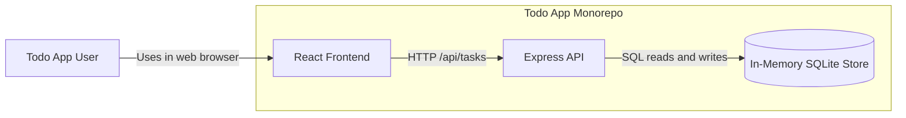
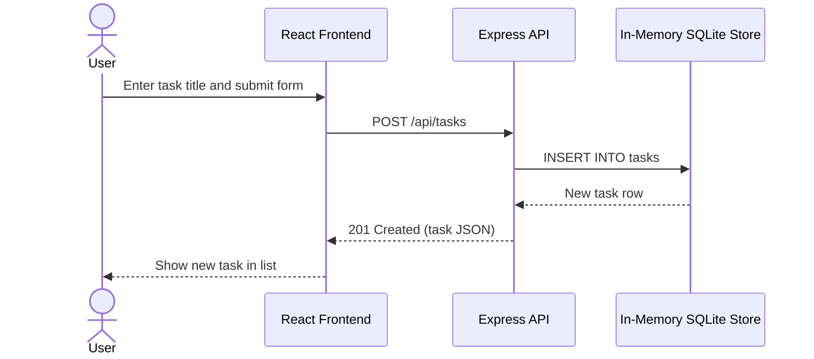

# Cloud Architecture Overview

The monorepo contains a React frontend and an Express API. Users interact with the frontend in a web browser, the frontend sends HTTP requests to the API, and the API reads and writes task data in an in-memory SQLite database. Because the database is process-local, task data is lost whenever the API process restarts.

## Creating a TODO

The sequence below shows the request flow when a user submits the task form to create a new TODO.

